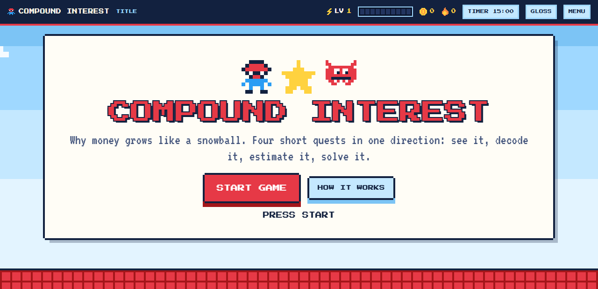
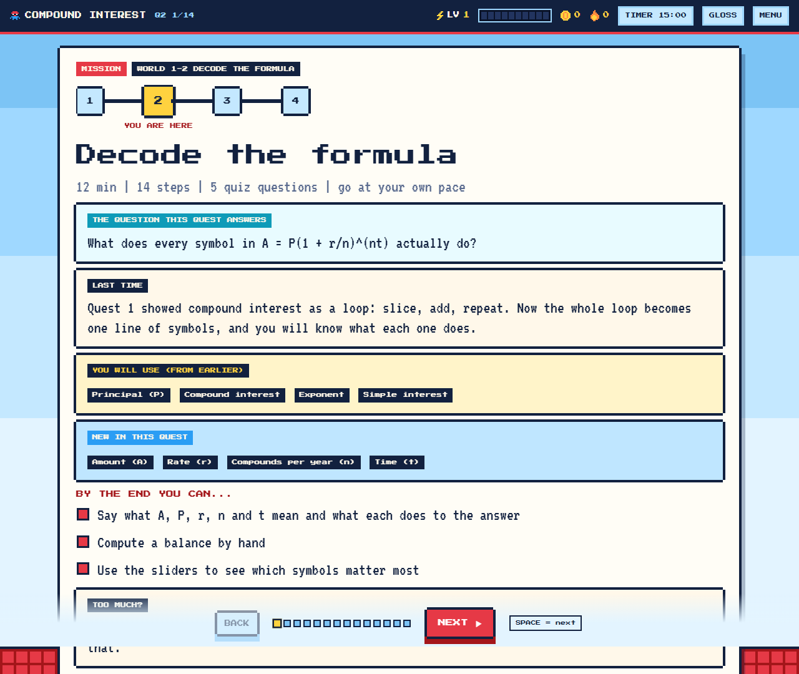
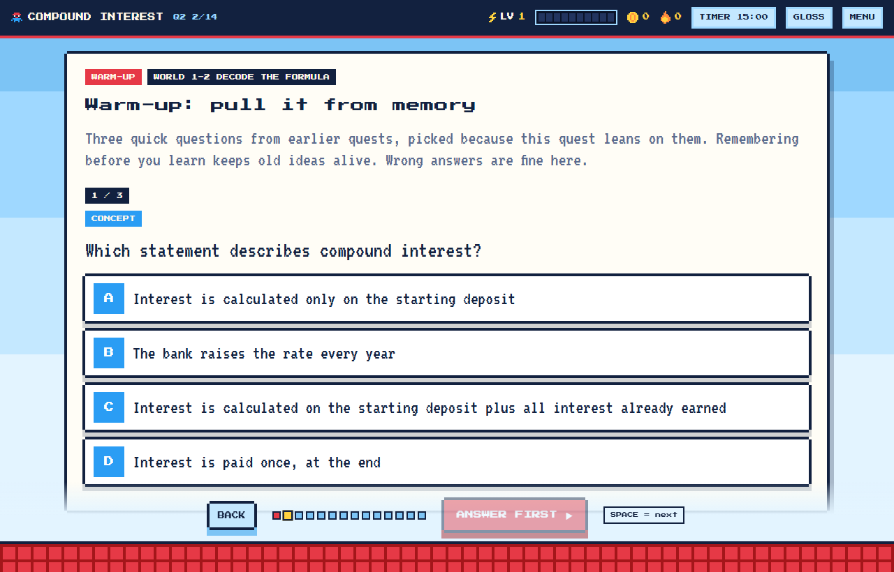
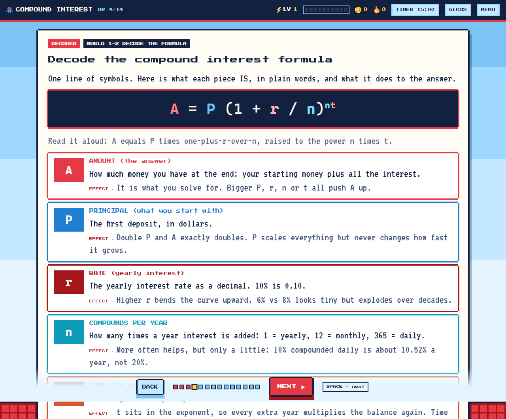
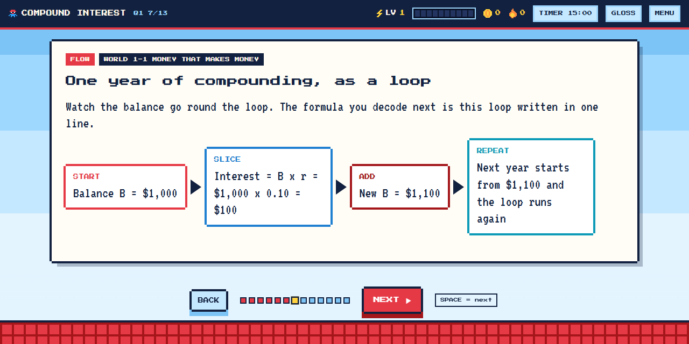
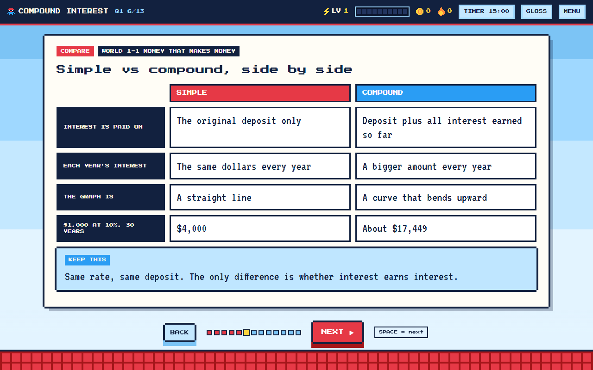
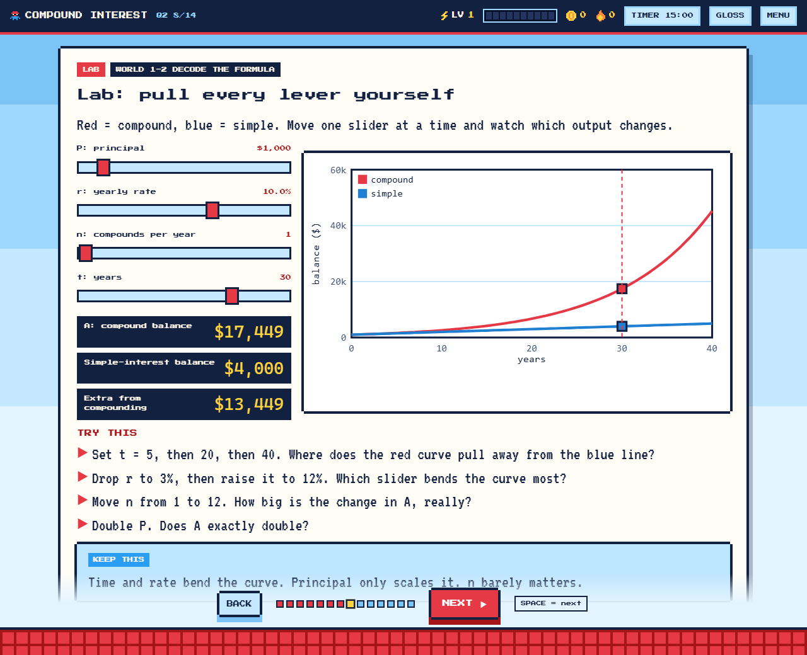
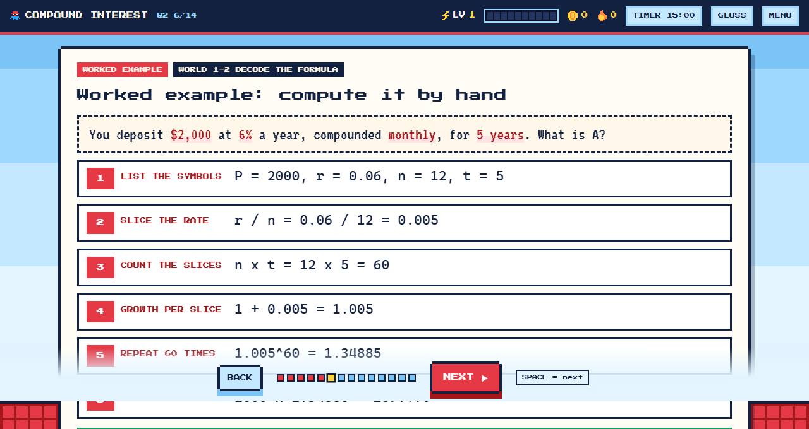
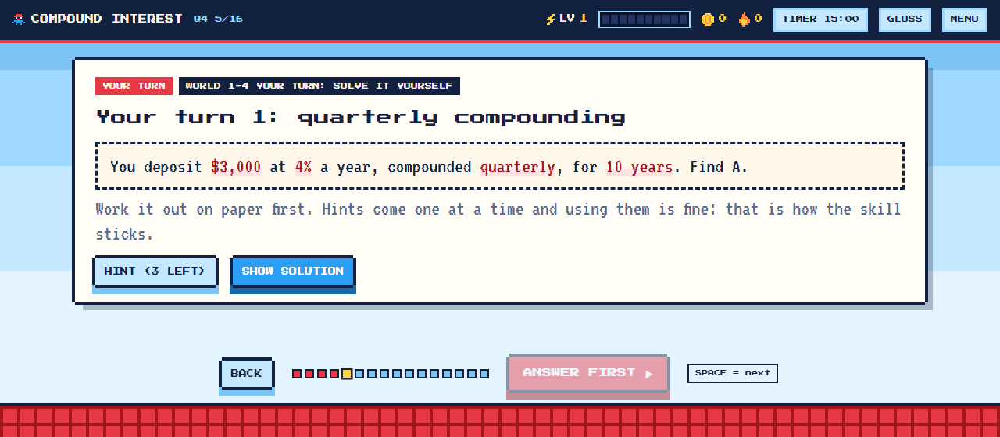
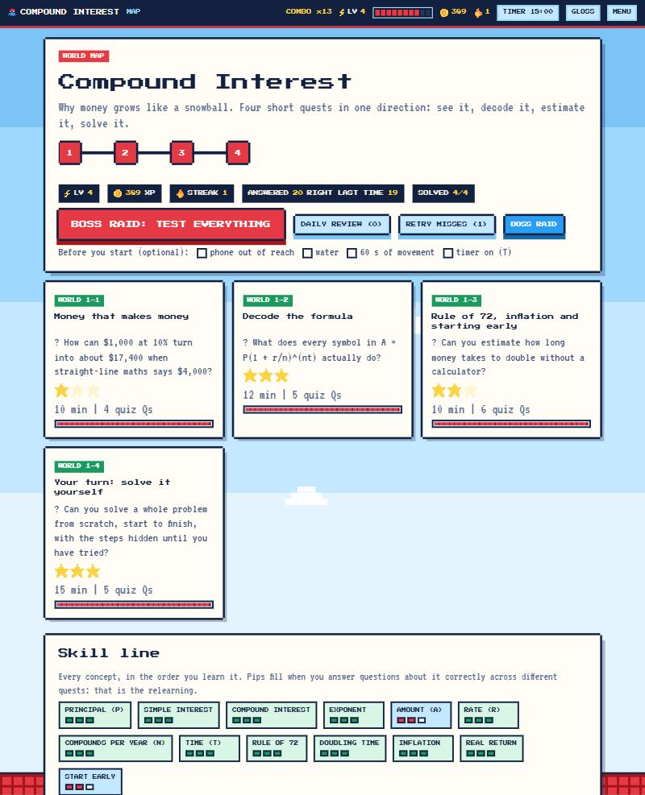

# gamify-learn

**Turn any course material into a retro study game that teaches in one straight line, from zero to solving problems.**

Give an AI assistant your lecture slides, PDFs, notes or a textbook chapter. It maps the topic into a prerequisite line, writes a short `course.json`, and this skill's engine turns it into **one offline HTML file**: a light-blue-sky, red-brick, 8-bit game with ordered quests, XP, levels, streaks, badges, boss raids, quizzes, spaced flashcards, and "your turn" problems at the end.

Built for people who find long slides hard to focus on (ADHD-friendly by design, grounded in research with honest limits) and for everyone who has stared at a formula like `P_C = R(P_W − C)` and thought: *but what IS P_C?*



## What makes it different

**1. One direction.** Quests unlock in order. Each concept is taught **once**, in the place where you are ready for it, and never used before it is taught. The validator rejects courses that jump ahead. No mixing topics, no wandering.

**2. A story, not a pile of slides.** Every quest opens with *the question it answers*, says *what you did last time*, lists *what you will use from earlier* and *what is new*, and ends with a cliffhanger into the next quest.



**3. Relearning on purpose.** A concept taught once is forgotten. Every concept must come back at least three times, at least once in a later quest:
- every quest (after the first) opens with a **warm-up**: 3 questions from earlier quests, picked because the new quest leans on them, plus anything you missed
- quizzes and flashcards are tagged with the concepts they test
- flashcards return after 1, 2, 4, 7 and 14 days; boss raids mix every quest
- a **skill line** fills a concept's pips only when you answer it correctly again and again across quests



**4. Every symbol decoded.** A formula never appears alone. A *decoder* screen gives, per symbol, its name, what it IS in plain words, and what happens to the answer when it changes. Someone with zero background can follow.



**5. See it, then move it.** Flow diagrams, side-by-side comparisons, and live labs where you pull each slider and watch the formula act.

| | |
|---|---|
|  |  |
|  |  |

**6. Ends with you solving.** Worked example, then "Your turn": a problem, a hint ladder you open one hint at a time, the full solution after your attempt, and an honest self-rating. The last quest is nothing but problems that mix everything you learned.



**7. Games as a thin wrapper.** XP, levels, combo meter, badges, boss raids. **Calm mode** turns off all motion and sound. One file, works offline, no accounts, no tracking; progress lives in your browser and exports as a file.



## The research it is built on

Short chunks, curiosity hooks, testing yourself, spaced relearning, worked examples that fade into solving, instant feedback. Each design rule is tied to a finding in [`references/evidence.md`](skills/gamify-learn/references/evidence.md), with the **limits stated**: most ADHD studies are small or done with children, gamification results are mixed, and a spacing meta-analysis found no clear edge for expanding intervals over uniform ones. It is a study aid, not a treatment.

| Finding | What the game does |
|---|---|
| Short segments helped learners with ADHD more in a small 2026 study | One idea per screen, ~12-minute quests, lines reveal one at a time |
| Practice testing helps (d ≈ 0.5) but does not repair poor first encoding | Teach clearly first, then quiz after each idea |
| Spaced retrieval beats massing | Warm-ups, flashcard schedule, raids, skill line |
| Curiosity boosts encoding (PACE framework) | Predict first, a question per quest, cliffhangers |
| Worked examples help novices; fading bridges to solving | Worked, then hint-ladder solves, then a capstone |
| Feedback and levels helped in one RCT, effects mixed overall | Thin game layer + Calm mode |

## Install

You need an AI assistant that supports Agent Skills (for example Claude Code or Claude.ai). The skill is plain files, so you can also run the scripts without any assistant (see *Use it by hand*).

### Claude Code: plugin marketplace

```
/plugin marketplace add Riyan-420/gamify-learn
/plugin install gamify-learn@gamify-learn
```

### Claude Code: copy the folder

```bash
git clone https://github.com/Riyan-420/gamify-learn.git
cp -r gamify-learn/skills/gamify-learn ~/.claude/skills/
```

Use `.claude/skills/` inside a project to scope it to that project.

### Claude.ai or any app that uploads skills as a zip

Download **`gamify-learn.skill`** from the [latest release](https://github.com/Riyan-420/gamify-learn/releases/latest) (a normal zip with a `gamify-learn/` folder inside). Upload it where your app accepts custom skills (in Claude.ai: the Skills part of Settings; menu names change, so check the app's current help). If an app wants a `.zip`, rename the file.

## Use it

Open your assistant in a folder with your material and say something like:

> Use gamify-learn to turn `Lecture 3.pptx` and chapter 2 of the textbook into a study game. I know nothing about this topic, my exam is in two weeks, and I have ADHD so keep it in one straight line.

The assistant will ask a couple of questions, extract the text, show you the **ordered quest list and concept map** for approval, write the course, run the strict validator, build, test, and hand you `YourCourse.html`. Double-click it. That is the whole install for the learner.

**Keys:** `SPACE` reveal/next · `←` back · `A–D` answer · `H` map · `R` daily review · `G` glossary · `T` focus timer · `M` sound · `Esc` close.

## Try the demo first

[`skills/gamify-learn/examples/compound-interest/compound-interest.html`](skills/gamify-learn/examples/compound-interest/compound-interest.html) is a complete four-quest game (see it, decode it, estimate it, solve it) using every feature: concept ledger, warm-ups, decoder, flow, compare, worked example, labs, hint-ladder solves, 20 quiz questions and 19 flashcards. Download the file and open it in any browser. Its source, [`course.json`](skills/gamify-learn/examples/compound-interest/course.json), is the best template for writing your own.

## Use it by hand (no assistant)

Needs Python 3 (developed and tested on 3.11). `build.py` and `validate.py` use only the standard library.

```bash
python skills/gamify-learn/scripts/validate.py my-course.json --strict   # errors, one-direction ledger, teaching warnings
python skills/gamify-learn/scripts/build.py my-course.json -o my-course.html
python skills/gamify-learn/scripts/smoke_test.py my-course.html          # needs Chrome, Chromium or Edge
python skills/gamify-learn/scripts/extract_text.py slides.pptx -o extracted   # pip install pypdf python-pptx python-docx
```

Docs: [schema](skills/gamify-learn/references/schema.md) · [learning line (sequencing, linking, relearning)](skills/gamify-learn/references/learning-line.md) · [authoring guide](skills/gamify-learn/references/authoring-guide.md) · [evidence](skills/gamify-learn/references/evidence.md).

## How a course is built

```
source ─► extract ─► prerequisite map ─► ordered quests ─► course.json ─► validate --strict ─► build ─► game.html
                     (concept ledger:    (≤5 new ideas     (teaches /        (no forward refs,        (one offline
                      what needs what)    per quest)        needs / tags)     3+ relearnings each)     file, tested)
```

Step types: `predict` · `idea` · `decode` · `flow` · `compare` · `worked` · `lab` · `solve` · `figure` · `dump` · `html`, plus tagged quizzes and flashcards, and an automatic mission, warm-up and recap per quest.

## Repo layout

```
skills/gamify-learn/
  SKILL.md                  instructions the assistant reads (learning line + research rules)
  scripts/                  extract_text, validate, build, smoke_test
  assets/engine/            engine.js, engine.css, template.html
  assets/fonts/             Press Start 2P + VT323 (SIL OFL 1.1)
  references/               learning-line, authoring-guide, schema, evidence
  examples/compound-interest/
.claude-plugin/             plugin + marketplace manifests
tools/package.py            builds dist/gamify-learn.skill
```

## Limits worth knowing

- **It is a study aid, not a treatment.** The ADHD-related research behind the design is mostly small studies, often with children. Results vary by person.
- **The locked linear path is a design choice** for focus, not an ADHD-tested intervention. Menu → "Unlock every quest" removes it.
- **The content is only as good as the source and the author.** An AI-written course can contain mistakes. The skill makes the assistant compute worked examples with code and flag unclear source material, but check anything you will be graded on against your own notes.
- **Copyright.** Use your own course material for your own study. Do not publish games that embed copyrighted figures or text you do not have the right to share.
- Scanned PDFs have no text to extract and need OCR first.
- Progress lives in one browser's local storage. Use Menu → Export to move or back it up.

## License

[MIT](LICENSE). The bundled pixel fonts are under the SIL Open Font License 1.1 (see `skills/gamify-learn/assets/fonts/`).
