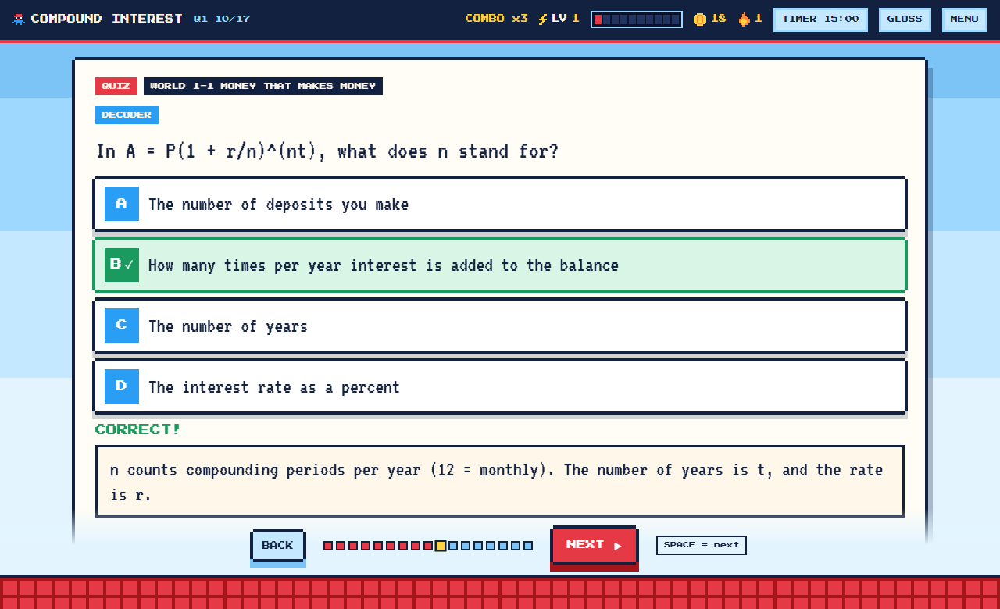
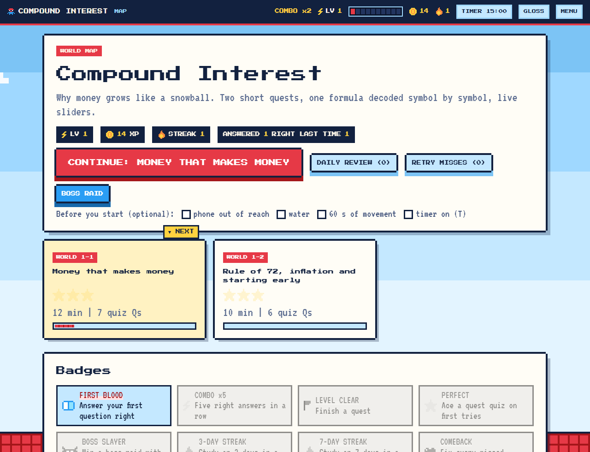

# gamify-learn

**Turn any course material into a retro study game that actually teaches.**

Give an AI assistant your lecture slides, PDFs, notes or a textbook chapter. It writes a short `course.json`, and this skill's engine turns it into **one offline HTML file**: a light-blue-sky, red-brick, 8-bit game with quests, XP, levels, streaks, badges, boss raids, quizzes and spaced flashcards.

It was built for people who find long slides hard to focus on (ADHD-friendly by design) and for everyone who has stared at a formula like `P_C = R(P_W − C)` and thought: *but what IS P_C?*


## What makes it different

- **Every symbol decoded.** A formula never appears alone. A *decoder* screen shows the formula, then one card per symbol: its name, what it IS in plain words, and what happens to the answer when it changes. Someone with zero background can follow.
- **Move the sliders, see the symbols act.** Built-in labs evaluate your formulas live and draw plots or custom SVG pictures.
- **Learning, not just points.** Guess first, learn in short chunks, brain-dump from memory, quiz with explained wrong answers, spaced flashcards (1, 2, 4, 7, 14 days), and mixed-topic boss raids where missed questions come back.
- **One file, works offline.** No server, no accounts, no tracking. Progress saves in your browser; export it as a file whenever you like.
- **Calm mode.** Not everyone wants sparkles. One switch removes motion and sound.
- **Honest about the evidence.** Short chunks, self-testing and spaced review are well supported; gamification is mixed. See [references/evidence.md](skills/gamify-learn/references/evidence.md).

| | |
|---|---|
|  |  |
| **Decoder:** what each symbol is and does | **Lab:** pull the levers, watch the curve |
|  |  |
| **Worked example:** every step labelled | **Quiz:** instant feedback, combo meter, XP |



## Install

You need an AI assistant that supports Agent Skills (for example Claude Code or Claude.ai). The skill itself is plain files, so you can also read and run the scripts without any assistant (see *Use it by hand*).

### Claude Code: plugin marketplace

```
/plugin marketplace add Riyan-420/gamify-learn
/plugin install gamify-learn@gamify-learn
```

### Claude Code: copy the folder

Download this repo (green **Code** button, then **Download ZIP**, or `git clone`) and copy `skills/gamify-learn` into `~/.claude/skills/` (all projects) or `.claude/skills/` inside one project.

```bash
git clone https://github.com/Riyan-420/gamify-learn.git
cp -r gamify-learn/skills/gamify-learn ~/.claude/skills/
```

### Claude.ai or any app that uploads skills as a zip

Download **`gamify-learn.skill`** from the [latest release](https://github.com/Riyan-420/gamify-learn/releases/latest) (it is a normal zip file with a `gamify-learn/` folder inside). Upload it where your app accepts custom skills (in Claude.ai this lives in the Skills part of Settings; menu names change, so check the app's current help). If an app wants a `.zip`, rename the file.

## Use it

Open your assistant in a folder that contains your material and say something like:

> Use gamify-learn to turn `Lecture 3.pptx` and chapter 2 of the textbook into a study game. I know nothing about this topic, my exam is in two weeks and it is mostly multiple choice.

The assistant will ask a couple of questions, extract the text, plan quests with you, write the course, build and test it, and hand you `YourCourse.html`. Double-click it. That is the whole install for the learner.

**Keys:** `SPACE` reveal/next, `←` back, `A–D` answer, `H` map, `R` daily review, `G` glossary, `T` focus timer, `M` sound, `Esc` close.

## Try the demo first

[`skills/gamify-learn/examples/compound-interest/compound-interest.html`](skills/gamify-learn/examples/compound-interest/compound-interest.html) is a complete two-quest game (compound interest and the Rule of 72) with a decoder, worked examples, three labs, 13 quiz questions and 11 flashcards. Download the file and open it in any browser. Its source, [`course.json`](skills/gamify-learn/examples/compound-interest/course.json), is the best template for writing your own.

## Use it by hand (no assistant)

Needs Python 3 (developed and tested on 3.11). `build.py` and `validate.py` use only the standard library.

```bash
python skills/gamify-learn/scripts/validate.py my-course.json     # errors + teaching-quality warnings
python skills/gamify-learn/scripts/build.py my-course.json -o my-course.html
python skills/gamify-learn/scripts/smoke_test.py my-course.html   # needs Chrome, Chromium or Edge
python skills/gamify-learn/scripts/extract_text.py slides.pptx -o extracted   # pip install pypdf python-pptx python-docx
```

The format is documented in [references/schema.md](skills/gamify-learn/references/schema.md). The teaching rules the assistant follows are in [references/authoring-guide.md](skills/gamify-learn/references/authoring-guide.md); they are worth reading even if you write the course yourself.

## How a course is built

```
 your material ──► extract text ──► plan quests ──► course.json ──► validate ──► build ──► game.html
   (pptx, pdf,                      (coverage         (decoders,     (errors +     (one offline
    docx, notes)                     checklist)        labs, quiz)    warnings)     file, tested)
```

Step types: `predict` · `idea` · `decode` · `worked` · `lab` · `figure` · `dump` · `html`, plus quizzes, flashcards and an automatic mission and recap per quest.

## Repo layout

```
skills/gamify-learn/
  SKILL.md                  instructions the assistant reads
  scripts/                  extract_text, validate, build, smoke_test
  assets/engine/            engine.js, engine.css, template.html
  assets/fonts/             Press Start 2P + VT323 (SIL OFL 1.1)
  references/               schema, authoring guide, evidence
  examples/compound-interest/
.claude-plugin/             plugin + marketplace manifests
tools/package.py            builds dist/gamify-learn.skill
```

## Limits worth knowing

- **It is a study aid, not a treatment.** The ADHD-related research behind the design is mostly small studies, often with children. Results vary by person.
- **The content is only as good as the source and the author.** An AI-written course can contain mistakes. The skill makes the assistant compute worked examples with code and flag unclear source material, but you should check anything you will be graded on against your own notes.
- **Copyright.** Use your own course material for your own study. Do not publish games that embed copyrighted figures or text you do not have the right to share.
- Scanned PDFs have no text to extract and need OCR first.
- Progress lives in one browser's local storage. Use Menu, then Export to move or back it up.

## License

[MIT](LICENSE). The bundled pixel fonts are under the SIL Open Font License 1.1 (see `skills/gamify-learn/assets/fonts/`).
